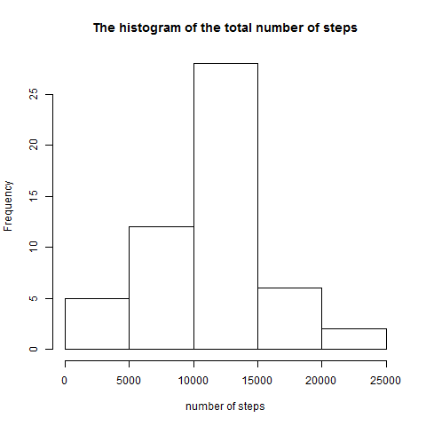
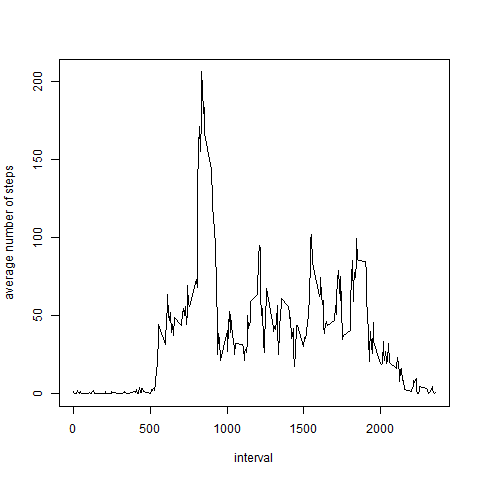
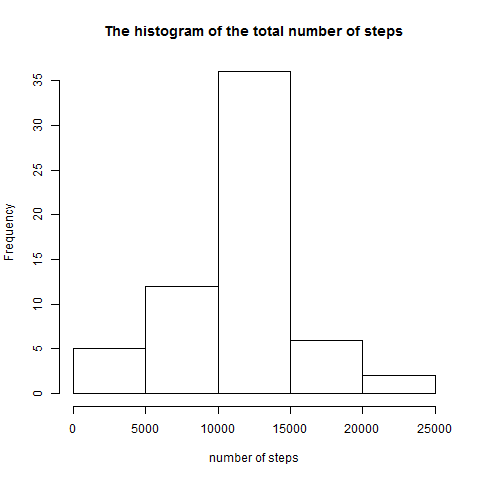
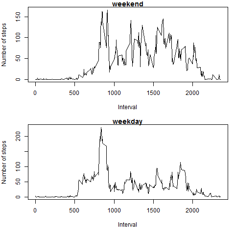

    
    
## Loading and preprocessing the data
    
```{r theData,echo = TRUE}
da<-read.csv("activity.csv",header=TRUE)
da[,2]<-as.Date(da[,2],format="%Y-%m-%d")
```
    
## What is mean total number of steps taken per day?
    
1.Calculate the total number of steps taken per day
```{r echo = TRUE}
da_1<-da[complete.cases(da),]
temp_date<-split(da_1,da_1[,c("date")],drop=TRUE) 
result1<-lapply(temp_date,FUN=function(x) sum(x$steps)) 
result2<-lapply(temp_date,FUN=function(x) max(x$steps)) 
numofstep<-cbind(result1,result2)
```
    
2.Make a histogram of the total number of steps taken each day
```{r echo = TRUE}
png(file = "figure/hist1.png",width = 480, height = 480, units = "px")
with(da,hist(as.numeric(numofstep[,1]),xlab="number of steps",main ="The histogram of the total number of steps"))
dev.off()
```
 
    
3.Calculate and report the mean and median of the total number of steps taken per day
```{r echo = TRUE}
result_mean<-lapply(temp_date,FUN=function(x) mean(x$steps)) 
result_median<-lapply(temp_date,FUN=function(x) median(x$steps)) 
numofstep_report<-cbind(result_mean,result_median)
numofstep_report
```
    
## What is the average daily activity pattern?
    
1.Make a time series plot (i.e. type = "l") of the 5-minute interval (x-axis) and the average number of steps taken, averaged across all days (y-axis)
```{r echo = TRUE}
temp_interval<-split(da_1,da_1[,c("interval")],drop=TRUE) 
result_mean_i<-lapply(temp_interval,FUN=function(x) mean(x$steps)) 
png(file = "figure/plot1.png",width = 480, height = 480, units = "px")
with(da,plot(names(result_mean_i),as.numeric(result_mean_i),type="l",xlab = "interval",ylab = "average number of steps"))
dev.off()
```
 

2.Which 5-minute interval, on average across all the days in the dataset, contains the maximum number of steps?
```{r echo = TRUE}
temp_i_max<-data.frame(interval=rep(names(result_mean_i),sapply(result_mean_i,length)), avg=unlist(result_mean_i))
max_i<-temp_i_max[max(temp_i_max[,2]),1]
```  
The 5-minute interval contains the maximum number of steps is **"`r max_i`"**.
    
## Imputing missing values

1.Calculate and report the total number of missing values in the dataset (i.e. the total number of rows with NAs).
```{r echo = TRUE}
da_na<-da[is.na(da),]
num_na<-nrow(da_na)
```
The total number of rows with NAs is **`r num_na`**.    

2.Devise a strategy for filling in all of the missing values in the dataset. The strategy does not need to be sophisticated. For example, you could use the mean/median for that day, or the mean for that 5-minute interval, etc.
```{r echo = TRUE}
da_fill<-da
#use the mean for that 5-minute interval,for filling in all of the missing values
for(i in 1:nrow(da_fill)){
    if(is.na(da_fill[i,1])){
        da_fill[i,1]<-temp_i_max[temp_i_max$interval==da_fill[i,3],2]
    }
}
```

3.Create a new dataset that is equal to the original dataset but with the missing data filled in.
```{r echo = TRUE}
write.csv(da_fill,"activity_fill.csv",row.names =FALSE)
```

4.Make a histogram of the total number of steps taken each day and Calculate and report the mean and median total number of steps taken per day. 
```{r echo = TRUE}
temp_date_fill<-split(da_fill,da_fill[,c("date")],drop=TRUE) 
result1_fill<-lapply(temp_date_fill,FUN=function(x) sum(x$steps)) 
result2_fill<-lapply(temp_date_fill,FUN=function(x) max(x$steps)) 
numofstep_fill<-cbind(result1_fill,result2_fill)

#Make a histogram of the total number of steps taken each day
png(file = "figure/hist2.png",width = 480, height = 480, units = "px")
with(da,hist(as.numeric(numofstep_fill[,1]),xlab="number of steps",main ="The histogram of the total number of steps"))
dev.off()
```
 

```{r echo = TRUE}
result_mean_fill<-lapply(temp_date_fill,FUN=function(x) mean(x$steps)) 
result_median_fill<-lapply(temp_date_fill,FUN=function(x) median(x$steps)) 
numofstep_report_fill<-cbind(result_mean_fill,result_median_fill)

#report the mean and median total number of steps taken per day
numofstep_report_fill
```

Ask:Do these values differ from the estimates from the first part of the assignment?   
Answer:**Yes,it's**.

Ask:What is the impact of imputing missing data on the estimates of the total daily number of steps?  
Answer:**Maybe it's the the mean for that 5-minute interval change the calculate result**.
    
## Are there differences in activity patterns between weekdays and weekends?

1.Create a new factor variable in the dataset with two levels ¨C ¡°weekday¡± and ¡°weekend¡± indicating whether a given date is a weekday or weekend day.
```{r echo = TRUE}
library(timeDate)
da_fill[isWeekday(da_fill[,2],wday = 1:5),4]="weekday"
da_fill[!isWeekday(da_fill[,2],wday = 1:5),4]="weekend"
colnames(da_fill)[4]<-"week"
```

2.Make a panel plot containing a time series plot (i.e. type = "l") of the 5-minute interval (x-axis) and the average number of steps taken, averaged across all weekday days or weekend days (y-axis). 
```{r echo = TRUE}
da_fill_wy<-da_fill[da_fill[,4]=="weekday",]
da_fill_wd<-da_fill[da_fill[,4]=="weekend",]
temp_wy<-split(da_fill_wy,da_fill_wy[,c("interval")],drop=TRUE) 
temp_wd<-split(da_fill_wd,da_fill_wd[,c("interval")],drop=TRUE) 
result_wy<-lapply(temp_wy,FUN=function(x) mean(x$steps)) 
result_wd<-lapply(temp_wd,FUN=function(x) mean(x$steps)) 

png(file = "figure/plot2.png",width = 480, height = 480, units = "px")
par(mfrow = c(2, 1), mar = c(5, 4, 1, 1))
with(da,plot(names(result_wd),as.numeric(result_wd),type="l",main="weekend",xlab = "Interval",ylab = "Number of steps"))
with(da,plot(names(result_wy),as.numeric(result_wy),type="l",main="weekday",xlab = "Interval",ylab = "Number of steps"))
dev.off()
```
 
